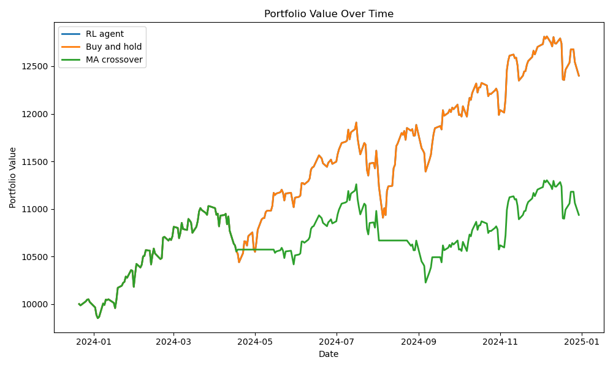

# StockRL

`StockRL` is a small reinforcement learning project for trading `SPY`, which is a very common stand-in for the S&P 500.

The idea is simple:

1. Download daily market data.
2. Turn that data into readable clues like `RSI`, `MACD`, moving averages, volatility, and momentum.
3. Let an RL agent choose `sell`, `hold`, or `buy`.
4. Compare the RL agent against simple baselines like buy-and-hold and a moving-average crossover rule.

This repo is built to be easy to read.

No giant framework.
No clever tricks.
Just a small pipeline you can follow from first principles.

## Best result so far

The most interesting honest result so far is that the best RL run mostly behaved like buy-and-hold.

That matters because it tells us something real:
- the agent did learn a sensible market behavior
- but it did **not** yet beat the simple benchmark
- the blue RL line is almost hidden under the green buy-and-hold line because they are so close



In plain English:
the current best agent more or less learned, "the market went up, so stay long."

That is not magic.
But it is a good baseline truth.

## Project layout

- `stockrl/data_loader.py`
  Downloads price data and cleans it into one simple table.
- `stockrl/features.py`
  Builds indicators from past data only, so the model does not accidentally cheat.
- `stockrl/portfolio_core.py`
  Holds the one true version of the money math.
- `stockrl/trading_env.py`
  Turns the market into a Gymnasium environment for RL.
- `stockrl/train.py`
  Trains one PPO model.
- `stockrl/evaluate.py`
  Evaluates a saved model, writes a plot, and writes a trade log.
- `stockrl/experiments.py`
  Runs multiple seeds and saves a results table.

## How the trading game works

The action space is intentionally tiny:

- `0` = sell, go flat
- `1` = hold
- `2` = buy, go long

The position space is tiny too:

- `0` = flat
- `1` = long

This is on purpose.
Smaller action spaces are easier to reason about.

## Why next-bar execution matters

This project uses a simple safety rule:

- the agent looks at day `t`
- the trade happens on day `t + 1`

Why?

Because if the agent sees the final price for today and also trades at that same final price, it is basically peeking at the answer sheet.

## What features the agent sees

The current feature set includes:

- daily return
- volume change
- `RSI`
- `MACD`
- short and long moving averages
- price relative to moving averages
- rolling volatility
- momentum
- ATR as a percent of price
- distance from recent highs and lows
- a simple market regime flag

These are not magic formulas.
They are just different ways of describing what the market has been doing lately.

## Reward design

The reward is now a little smarter than just "portfolio went up."

It uses:
- percentage portfolio growth
- a small penalty for trading
- a small penalty for deep drawdowns

The point is to teach the agent:
"make money, but do not thrash around and do not dig a giant hole."

## Quick start

Create an environment and install dependencies:

```bash
python3 -m venv .venv
source .venv/bin/activate
pip install -e ".[dev]"
```

Run the tests:

```bash
pytest
```

## Train one model

```bash
python -m stockrl.train --ticker SPY --start 2012-01-01 --end 2024-12-31 --timesteps 20000 --model-out artifacts/ppo_spy.zip
```

What this does:
- downloads SPY data
- builds features
- splits train, validation, and test by time
- trains PPO
- saves the model

## Evaluate one saved model

```bash
python -m stockrl.evaluate --ticker SPY --start 2012-01-01 --end 2024-12-31 --model-path artifacts/ppo_spy.zip --plot-out artifacts/performance.png --trade-log-out artifacts/trade_log.csv
```

This gives you:
- a text summary
- buy-and-hold comparison
- moving-average crossover comparison
- a performance plot
- a trade log CSV

## Run multi-seed experiments

This is the better way to judge RL.
One run can get lucky.

```bash
python -m stockrl.experiments --ticker SPY --start 2012-01-01 --end 2024-12-31 --timesteps 50000 --seeds 1,7,42,123 --output-dir artifacts/experiments
```

This saves:
- one trained model per seed
- one `experiment_results.csv`
- the best plot
- the best trade log

## What gets tested

The tests are designed to catch the quiet bugs that make trading projects lie:

- future leakage into today's features
- broken train/validation/test splits
- wrong trade timing
- wrong fee math
- drift between environment math and evaluation math
- smoke-test training that proves the whole pipeline runs

## Current takeaway

The system works.
The experiments are real.
The best RL run so far did not beat buy-and-hold.

That is useful.

It means the next job is not "add random complexity."
The next job is to run better experiments and find out whether the agent can learn something that actually improves on a simple long-only baseline.
